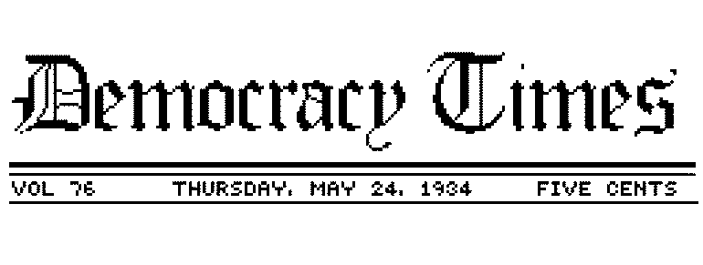

# The Democracy Times

A game about managing a newspaper in the 30's

## Help me with the Writing

There is a web editor to edit the text for the game's dialogues, to do that run `npm run devedit` then you can serve the files in the root file with `npm run editor`, go to `http://localhost:3000/editor` and change the text.

When you finish, you need to copy the json content displayed on the right and paste in the file `assets/dialogues.json` to replace it.
So you can submit a pull request with that changes.

Thanks <3 <3 <3
